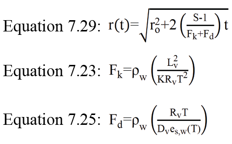

# SPIDER Validation Scripts
This Github repository houses the code used to generate the critical figures for Koolik et al., (2022). This Readme document contains information necessary for understanding and running the scripts.

For more information, see Koolik et al. (2022): https://doi.org/10.5194/amt-2021-26

---

### PCVI Transmission Efficiency Code
The code in the `PCVI_Transmission_Efficiency` folder calculates the transmission efficiency and D50 for the PCVI. The script assumes that the input data come from the [TSI Aerosol Instrument Manager (AIM) software](https://tsi.com/software/tsi-software-and-firmware-wizard/) recording from an Optical Particle Sizer. 

#### Requirements
* MATLAB License
* MATLAB Statistics and Machine Learning Toolbox

#### Acknowledgments
This script utilizes the `sigm_fit` function contributed to the MATLAB Central File Exchange by User R P. For more information about the `sigm_fit` function, see the [File Exchange](https://www.mathworks.com/matlabcentral/fileexchange/42641-sigm_fit).

---

### PCVI Calibration Code
The code in the `PCVI_Calibration` folder calculates the transmission efficiency and D50 for the PCVI. The script assumes that the input data come from the [TSI Aerosol Instrument Manager (AIM) software](https://tsi.com/software/tsi-software-and-firmware-wizard/) recording from an Optical Particle Sizer. 

#### Requirements
* Python 3
* `glob`, `os`, `re`, `pandas`, `datetime`, `numpy`, `seaborn`, `matplotlib`, and `scipy` libraries.

---

### L-PCVI Transmission Efficiency Code
The code in the `LPCVI_Transmission_Efficiency` folder calculates the transmission efficiency and D50 for the L-PCVI. The script assumes that the input data come from the [TSI Aerosol Instrument Manager (AIM) software](https://tsi.com/software/tsi-software-and-firmware-wizard/) recording from an Aerodynamic Particle Sizer. 

#### Requirements
* Python 3
* `os`, `re`, `pandas`, `datetime`, `numpy`, `seaborn`, `matplotlib`, and `scipy` libraries.

---

### SPIDER System Transmission Efficiency Code
The code in the `SPIDER_Transmission_Efficiency` folder calculates the transmission efficiency and D50 for the complete inlet system. The script assumes that the input data come from the [TSI Aerosol Instrument Manager (AIM) software](https://tsi.com/software/tsi-software-and-firmware-wizard/) recording from an Aerodynamic Particle Sizer. 

#### Requirements
* Python 3
* `os`, `re`, `runpy`, `pandas`, `datetime`, `numpy`, `seaborn`, `matplotlib`, and `scipy` libraries.

---

### Droplet Evaporation Code
The code in the `Droplet_Evaporation` folder calculates the evaporation of droplets throughout their residence time in the chamber based on an initial droplet size and chamber supersaturation. Droplet evaporation calcualtions are based on [Lohmann et al. (2016)](https://www.cambridge.org/core/books/an-introduction-to-clouds/F5A8096E7A3BD5C8FFD9208248DD1839).

The model is split into three files. The main file to call is `DropletEvap.m`. The other two files are supporting functions called by `DropletEvap.m`. The main calculation occurs in `easyrt.m`, which estimates the radius of a droplet as a function of time based on Lohmann et al. (2016), equation 7.29. Equation 7.29 from Lohmann et al. (2016), is reproduced below, along with Equations 7.23 and 7.25 which are relied upon for 7.29.

In this equation, *r(t)* is the droplet radius as a function of time. *r0* is the initial droplet radius, *S* is the supersaturation condition, *Fk* is the thermodynamic term related to the latent heat absorption due to evaporation (Equation 7.23 of Lohmann et al. (2016)), *Fd* is related to the saturation vapor pressure and diffusion (Equation 7.25 of Lohmann et al. (2016)), and *t* is time. In the supporting equations, *Lv* is the latent heat of vaporization, *K* is an empirical coefficient based on temperature, *Rv* is the gas constant for water vapor, *T* is the temperature, *Dv* is the vapor diffusion coefficient, and *es,w* is the equilibrium vapor pressure over a solution droplet based on Clausius-Claperyon. 

Finally, the `evap_figure.m` script plots the four scenarios of supersaturation.

#### Requirements
* MATLAB License
